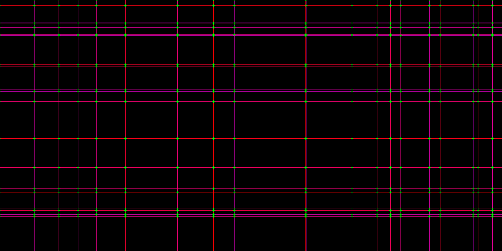

# Simple graphical example
This is example of graphical application with simple interface based on the SDL 2.0.

## Usage:
Simple run:
```
sudo apt install libsdl2-dev
clang start.c sim.c app.c -lSDL2
./a.out
```

To get LLVM IR:
```
clang app.c -S -emit-llvm -o test.ll
```
