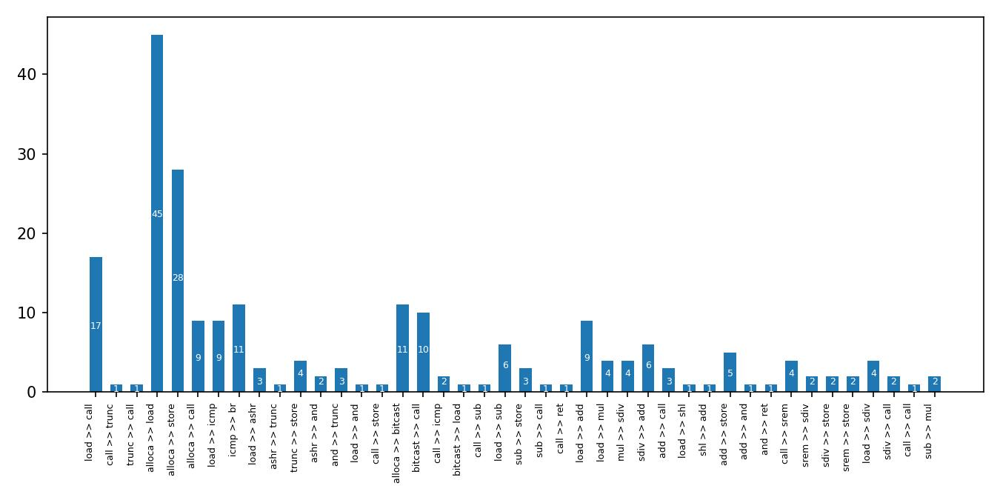

# LLVM Pass example
This is example of LLVM pass that collect static inforamtion about app IR and insert instrumentation for collecting dynamic information.

## Usage:
```
sudo apt install llvm
clang++ my_pass.cpp -fPIC -shared -I$(llvm-config --includedir) -o libPass.so
clang -fpass-plugin=./libPass.so log.c ../lab1/sim.c ../lab1/app.c ../lab1/start.c -lSDL2 -O2 > stat.txt
# | grep "phi" - to check phi existence
```

## Generate statistic:
```
python3 gen_statistic.py 
```

